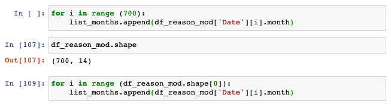

# Course Exercise: **Absenteeism**

### <u>**Introduction**</u>

* **Definition:** Absence from work during normal working hours, resulting in temporary incapacity to execute regular working activity.

* **Purpose:** To explore whether a person representing certain characteristics is expected to be away from work at some point in time or not.

* **Database Theory:** Using less characters will shrink the volume of the dataset.

1. Based on what information should we <ins>predict</ins> wether an employee is expected to be absent or not?

    * Do they have higher education?
    * How many children and pets they have?
    * How far they live from their workplace?
    * Others.

2. How would we <ins>measure</ins> absenteeism?

### <u>**Data Sets**</u>

* **Primary:** Data that has been created and did not exist prior eg. (survey, questionnaires etc.)

* **Secondary:** Already existing dataset that has been created by someone eg. (third-party survey results.)

* **Data Pre-processing:** a group of operations that will convert raw data into a format that is easier to understand and, hence, useful for further processing and analysis.

### <u>**Start of Exercise**</u>

* <u>Import **pandas** module</u>: It possess various tools for handling data in a tabular format (a DataFrame). Pandas = **PAN**EL **DA**ta

* Create a name for the variable that will contain the <u>DataFrame</u>: `raw_csv_data`.

  

* Using **Pandas**, `.read_csv()` method assigns the information from the initial *.csv file to this variable.

  

* In programming index counting starts from 0 not 1. Hence, the first row is index 0.

* Always eyeball or scan initial date set to check for errors and confirm structure.

* Adding `df.info()` prints a concise summary of the DataFrame.

  

  Terminology |  Mathematics  | Data Analytics | Programming
  ------------|-------------|-------------------|-----------------
  **Variable** | Symbol or a letter, that stands for a number we do not know yet (x,y) | Characteristic or a quantity that may change if its value over time under different circumstances. Referred to as: *features, attributes or input* | Acts like a storage location which contains a certain amount of information
  --------------
 

### <u>**Regression Analysis**</u>

* <u>Task</u>: Predict Absenteeism from Work

* <u>Dependent Variable</u>: Absenteeism Time in Hours

* <u>Independent Variable</u>: All the other columns

* Use `.drop()` to remove specified rows or columns which do not contribute to the analysis.

* Use `axis` to specify the position of the desired variable to be dropped, default axis (vertical) = 0.

  

* Note that the `.drop()` function delivers a temporary output.

  

* To make this permanent assign the expression containing the drop function to the original variable or data set.

  

* To examine a respective column: `dataset['column_name']`

  

  

* To extract a list containing <u>**distinct values only**</u>: Pythons unique method, `.unique()`.

  

  

* The `len()` function may be used to count the number of unique values available.

  

### <u>**Splitting a Variable into Multiple Dummy Variables**</u>

* Remove values that represent <u>categories</u> that are <u>equally</u> meaningful. Often referred to as Categorical Nominals, meaning the numbers can be replaced with words.

* **Quantitative Analysis:** <u>Add numeric meaning</u> to our categorical values.

* **Dummy Variable:** an explanatory bnary variable that equals <u>1</u> if a certain categorical effect is <u>present</u>, and equals <u>0</u> if that same effect is <u>absent</u>.

* Using **Pandas**, the `.get_dummies()` method can be used to apply dummy variables.

* **Multicollinearity:** refers to a situation in which two or more explanatory variables in a multiple regression model are highly linearly related. We have perfect multicollinearity if, for example as in the equation above, the correlation between two independent variables is equal to 1 or −1. **This should be avoided**.

### <u>**Categorizing the Various Reasons for Absence**</u>

* Given data tables containing a lot of <u>variables of the same type</u>. These variables may be put in a **group** or **class**.

* **Grouping or Classification:** re-organizing a certain type of variables into groups in a regression analysis. Note that after splitting these variables or objects into smaller pieces, each piece itself will be a DataFrame object as well.

* In Python, the `.loc[]` method can be used to separate a data frame. This will retrieve the rows and columns of interest, `.loc[rows, columns]`. This method is <u>label-based</u>, so the desired row or column names need to be indicated (either as integers or strings accordingly).

  

### <u>**Concatenation in Python**</u>

* In ***Pandas**, the `.concat()` method can be used to add the new group of reason types to the df Data table.

  

* The newly added columns can be assign more meaningful names.

  

* In Python, the `.head ()` method may be used to display the top five rows of a data table, together ith the relevant column names.

  

### <u>**How to Reorder Columns in a DataFrame in Python**</u>

* The columns can be reshuffled an assigned to the data set accordingly.

  

### <u>**Creating a Checkpoint**</u>

* <u>In programming in general, and in Jupyter in particular</u>, creating checkpoints refers to storing the current version of the <u>code</u>, not really the content of the variable.

* This can be described as an interim save of the work done or a snapshot. Ultimately, creating a temporary save of the work done reduces the risk of losing important data at a later stage.

* Create a copy of the current state of the **`df`** DataFrame.

  

### <u>**Analyzing the Date Columns**</u>

* In 1 column, or in 1 series, we can have values of a <u>single data type</u> only.

  

  

* The `timestamp` is a classical data type found in many programming languages, used for values representing <u>dates and time</u>.

* The **Pandas**, `.to_datetime()` method converts values into <u>timestamps</u>. During this conversion, the proper format of the <u>date values to be worked on</u> must always be specified. 

* The `format` parameter takes control over how python will read the <u>current</u> dates, so that it can accurately understand which numbers refer to days, months, years, hours, minutes, or seconds. eg. `format` = `'string'`

* The `'string'` will <u>not</u> designate the format of the timestamps <u>about to be created</u>.

  Syntax | Description
  -------|------------
  `%d`   | Day
  `%m`   | Month
  `%Y`   | Year
  `%H`   | Hour
  `%H`   | Minute
  `%S`   | Second
  ------

   

   

   

### <u>**Retrieving the "Month Value" from the "Date" Column**</u>

* The rationale behind this process is to consider if employees are <u>more likely</u> to be absent or away from their desk <u>during certain months</u>. The same rational may be applied to <u>days of the week</u>.

* To extract the month value only, the `.month` is needed the end of the syntax. Note that months take values from <u>1 to 12</u>.

  

* A `for` loop can be created to run through the entire Date column and assign a month value for each date (700 rows). The `range()` function is essential to run through `i` or each row in the date column.

* If the data set is dynamic and the rows may change over time, the `.shape()` property of **`df`** may be used to iterate for each number of rows present in the the data. This replaces the need to specify a number of rows in the `range()` function.

* The `.append()` method attaches the new value obtained from each iteration to the existing content of the designated list.

  

* The `len()` function can be used to verify that the above function has yielded a month list according to the number of rows available in the data set.

* The newly created list of months may then be added to the data set as a `Month Value` column.

* The `.head()` method may be used to 

  

### <u>**Retrieving the "Day of the Week" from the "Date" Column**</u>

* The rational for this process is the same as above. Note that days <u>Monday to Friday</u> take values from <u>0 to 6</u>.

* To <u>apply</u> a certain type of modification iteratively on each value from a Series or a column in a DataFrame, it is a great idea to create a function that can execute this operation for one element, and then implement it to all values from the column of interest.

* Define a function, `date_to_weekday`, that will directly return the weekday from the data contained in the Date column. The `.weekday()` method is added to the syntax to obtain the desired result. 

* Then a `'Day of the Week'` column may be added to **`df`**. The values from the 'Date'  may then be assigned to this new column while implementing the `date_to_weekday` function to each row using the `.apply` method.

    

* Current DataFrame arrangement after Exercise_1: Dropping the 'Date' column and Exercise_2: Reordering the column headers.

  
  

* New checkpoint created: `df_reason_date_mod`.

### <u>**Analysis of the Next 5 Columns in df**</u>

* Providing a reason to explain the relevance of the remaining columns and confirming their data types.

  

### <u>**Numerical Features which may Behave like Categorical Ones**</u>

* The `Education, Children` and `Pets` columns in  **`df`** represent categorical data containing integers. The Children and Pets columns refer to how many kids or pets a person has precisely.

* The `Education` column needs to be transformed into a dummy variable. To extract a list containing <u>**distinct values only**</u>: Pythons unique method, `.unique()`.

* For the sake of this data set, the Education level or rating indicates the following: 1 - HighSchool, 2 - Graduate, 3 - Postgraduate, 4 - Masters or phD.

* Applying the Pandas `.value_counts()` method to a Series object such as the `Education` column, allows us to see the number of occurrences for each rating. From the results, only the HighSchool rating has enough count to stand alone, the others will be grouped into one.

  

* The can be achieved by using the `.map()` method to insert a dictionary which assigns new values to the currently existing ratings in the `Education` column.

  

* Create a final checkpoint.

  

### <u>**Integration - Integrating Python and SQL**</u>

* <U>Assumption</u>: Task is being handled by a <u>Business Intelligent Analyst</u>. A separate team has created a <u>Python Model</u> capable of running the <u>machine code module</u>.

  Model| Module
  -----|-------
  Analytical tool applied to solve the business problem | Software  component containing the code that will help execute the 'model'
  ---------

* According to the python documentation, a module is a file containing Python definitions and statements, with the suffix <u>**.py**</u>.

* Refer to the **Integration Folder** (5 files).

### <u>**How to Use the 'absenteeism_module' in Python - Part I & II**</u>

* The `'absenteeism_model'` is the name of the class that has been created. An instance of the class must be created, the instance can be called `'model'`. By definition, the 'absenteeism_model' requires two arguments:

  * 1st is the <u>**model**</u> file , containing a fine-tuned finalized version of the logistic regression model.
  
  * 2nd is the traditional statistical technique, used to obtain prediction values, using the <u>**scaler**</u> file.

  * The <u>**scaler**</u> file contains the statistical parameters needed to adjust the magnitude of all numbers we have in this data set. 

* Call the `.load_and_clean_data()` method stored in the model will preprocess the entire data set provided.

* Call the `.predicted_outputs()` method to feed the cleaned data into the model, and deliver the output: the predicted probability that an individual will be absent from work.

* The `'probability'` column displays the prediction in a float style while the `'Prediction'` column measures probability scores above 0.5 or 50% as 1 and below as 0.

  

### <u>**Creating the 'predicted_outputs' Database in MySQL**</u>

* It will be impossible to send any data from Jupyter to MySQL workbench it is important to create a <u>connection to a specific database</U>.

* Incorporating SQL gives BI analysts more control over the data.

* SQL activities:

  * Create a database, use a name that explains its role.
  
  

  * Next, install **'pymysql'** and import it in to Python.

  * Note that Python variables may be used as arguments of the `.execute()` method as well.

  * When executing an <u>SQL statement</u> affecting the database state from <u>Python</u>, you must always <u>commit</u> to this action.

  