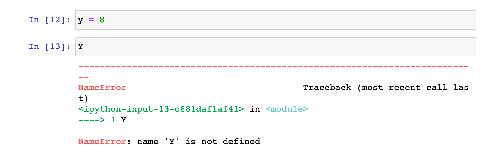
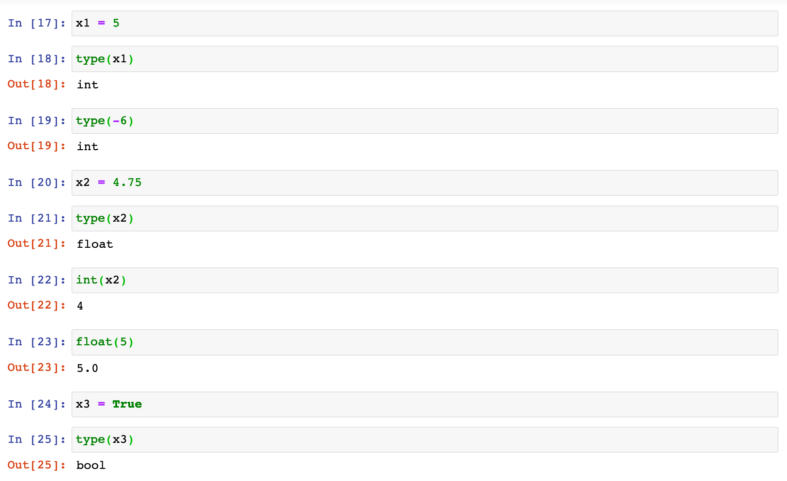

# Start of Python Training via Udemy Courses

### **Introduction**
**Program:** Sequence of instructions that designate how to execute a computation.  
**Programming:** Taking a task and writing it down in a programming language that the computer can understand and execute.  

### **Assigning Values**

A certain number of variables may be assigned to the same number of variables. The *=* operator may be used to assign or bind values to variables. For Example: `x = 8` or `x,y =(8,9)`. 

**Print:** Displays or prints the value of a certain variable.

**Case Sensitivity:** Ensure to retain the same case type used when assigning while printing or displaying variable. 

### **Numbers and Boolean Values**

**Integer:** Positive of negative whole number; without a decimal point. For Example: `x1 = 5`. In this scenario, x1 may be referred to as an integer. This may be confirmed using the `type(var)` function. The type function, `type (value)`, may also be applied to a value instead of a variable.

**Floating Points (floats):** Real number; with a decimal point. However `int( )` may be used to transform the variable into an integer. Furthermore, `float( )` transforms the variable into a float.

Not all variables should assume numerical values. An example of these type of values are **Boolean values**:  "True" or "False" values corresponding to 1s or 0s and On or Off. The True and False must be written with capital T and F.

### **Strings**
These are text values composed of a sequence of characters. 

Quotation marks are used to characterize values as strings. If there is a need to add strings to a return, the *+* operator is required. Two value types cannot be used at the same time, for Example: `y = 10, print (y + " Dollars")` will return an error. However `str( )` converts a number into text. 

Python can automatically discern the type of data being entered (integer, string, etc.) this does not need to be specified. The `\` is an escape character as it changes the interpretation of characters immediately after it. For Example: `'I\'m fine'` returns `"I'm fine"`. 

### **Python Syntax Fundamentals**

