# Start of Python Training via Udemy Courses

### **Introduction**
**Program:** Sequence of instructions that designate how to execute a computation.  
**Programming:** Taking a task and writing it down in a programming language that the computer can understand and execute.  

### **Assigning Values**

A certain number of variables may be assigned to the same number of variables. The `=` operator may be used to assign or bind values to variables. Example: `x = 8` or `x,y =(8,9)`. The system overwrites any assigned values with the most recent statement. Example: `x = 8` (first instance), `x = 9` (second instance), now x has been reassigned the value of 9.

**Print:** Displays or prints the value of a certain variable.

**Case Sensitivity:** Ensure to retain the same case type used when assigning while printing or displaying variable. 

### **Numbers and Boolean Values**

**Integer:** Positive of negative whole number; without a decimal point. Example: `x1 = 5`. In this scenario, x1 may be referred to as an integer. This may be confirmed using the `type(var)` function. The type function, `type (value)`, may also be applied to a value instead of a variable.

**Floating Points (floats):** Real number; with a decimal point. However `int( )` may be used to transform the variable into an integer. Furthermore, `float( )` transforms the variable into a float.

Not all variables should assume numerical values. An example of these type of values are **Boolean values**:  "True" or "False" values corresponding to 1s or 0s and On or Off. The True and False must be written with capital T and F.

### **Strings**
These are text values composed of a sequence of characters. 

Quotation marks are used to characterize values as strings. If there is a need to add strings to a return, the *+* operator is required. Two value types cannot be used at the same time, Example: `y = 10, print (y + " Dollars")` will return an error. However `str( )` converts a number into text. 

Python can automatically discern the type of data being entered (integer, string, etc.) this does not need to be specified. The `\` is an escape character as it changes the interpretation of characters immediately after it. Example: `'I\'m fine'` returns `"I'm fine"`. 

### **Python Syntax Fundamentals**

**Double Equality Sign:** The `==` means equals or equality of values. It returns a boolean value, True or False.

**Comments:** These are sentences not executed by the computer. They may be inserted by using a `#` symbol at the start of a sentence.

**Indexing Elements:** To obtain a character within a string, an indexing statement is used. Example: `"Name_of_Variable" [index_of_element]`. In python, characters are counted from 0, not from 1.

**Code Structure and Indentation:** Statements belonging to a block of code or command can be indented using the Tab key, while separate statements or blocks of commands can begin from the far left.

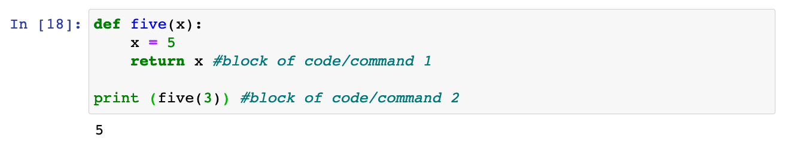

### **Python Operators**

Operators are used to perform operations on variables and values.

Python divides the operators in the following groups:

* Arithmetic operators
* Assignment operators
* Comparison operators
* Logical operators
* Identity operators
* Membership operators
* Bitwise operators

Arithmetic operators are used with numeric values to perform common mathematical operations:

Arithmetic Operators | Description    | Example
---------------------|----------------|--------
/                    | Division       | x / y
`+`                  | Addition       | x + y
%                    | Modulus        | x % y
`-`                  | Subtraction    | x - y
//                   | Floor division | x // y
`*`                  | Multiplication | x * y
**                   | Exponentiation | x ** y

Assignment operators are used to assign values to variables:

Assignment Operators | Example  | Same As
---------------------|----------|------------
=                    | x = 5    | x = 5
+=                   | x += 3   | x = x + 3
-=                   | x -= 3   | x = x - 3
*=                   | x *= 3   | x = x * 3
/=                   | x /= 3   | x = x / 3
%=                   | x %= 3   | x = x % 3
//=                  | x //= 3  | x = x // 3
**=                  | x **= 3  | x = x ** 3
&=                   | x &= 3   | x = x & 3
`|=`                 | `x |= 3` | `x = x | 3`
^=                   | x ^= 3   | x = x ^ 3
`>>=`                | x >>= 3  | x = x >> 3
<<=                  | x <<= 3  | x = x << 3

Comparison operators are used to compare two values:

Comparison Operators | Name                     | Example
---------------------|--------------------------|--------
==                   | Equal                    | x == y
<                    | Less than                | x < y
!=                   | Not equal                | x != y
`>`                  | Greater than             | x > y
<=                   | Less than or equal to    | x <= y
`>`=                 | Greater than or equal to | x >= y

Logical operators or Boolean operators are used to combine conditional statements.\
When combining logical operators, the **order of importance matters**. NOT is 1st, AND is 2nd and OR is 3rd:

Logical Operators | Description                                             | Example
------------------|---------------------------------------------------------|----------------------
and               | Returns True if both statements are true                | x < 5 and  x < 10
or                | Returns True if one of the statements is true           | x < 5 or x < 4
not               | Reverse the result, returns False if the result is true | not(x < 5 and x < 10)

Identity operators are used to compare the objects, not if they are equal, but if they are actually the same object, with the same memory location:

Identity Operators | Description                                            | Example
-------------------|--------------------------------------------------------|-----------
is                 | Returns True if both variables are the same object     | x is y
is not             | Returns True if both variables are not the same object | x is not y

Membership operators are used to test if a sequence is presented in an object:

Membership Operators | Description                                                                      | Example
---------------------|----------------------------------------------------------------------------------|-----------
in                   | Returns True if a sequence with the specified value is present in the object     | x in y
not in               | Returns True if a sequence with the specified value is not present in the object | x not in y

Bitwise operators are used to compare (binary) numbers:

Bitwise Operators | Description          | Description
------------------|----------------------|--------------------------------------------------------------------------------------------------------
~                 | NOT                  | Inverts all the bits
&                 | AND                  | Sets each bit to 1 if both bits are 1
`|`               | OR                   | Sets each bit to 1 if one of two bits is 1
^                 | XOR                  | Sets each bit to 1 if only one of two bits is 1
<<                | Zero fill left shift | Shift left by pushing zeros in from the right and let the leftmost bits fall off
`>>`              | Signed right shift   | Shift right by pushing copies of the leftmost bit in from the left, and let the rightmost bits fall off

### **Conditional Statements**

**IF statement:** This requires an `if condition` : `conditional code`. Example: `if 5 == 15/3` : `print ("Hooray!")`. For better clarity, after the colon, indent the conditional code on the next line. 

**ELSE Statement:** This provides an alternative case, `else code` when the `if condition` does not satisfy the `conditional code`.

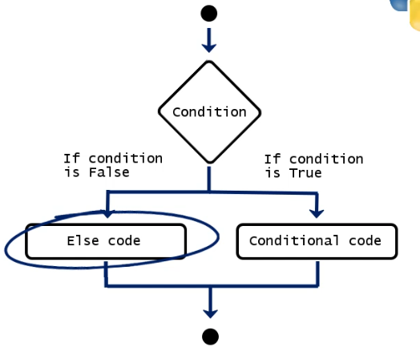

**ELSE IF or ELIF Statement:** This provides an alternative cases and ends with an `else code`. It returns the assigned result based on the given `conditional code`. 

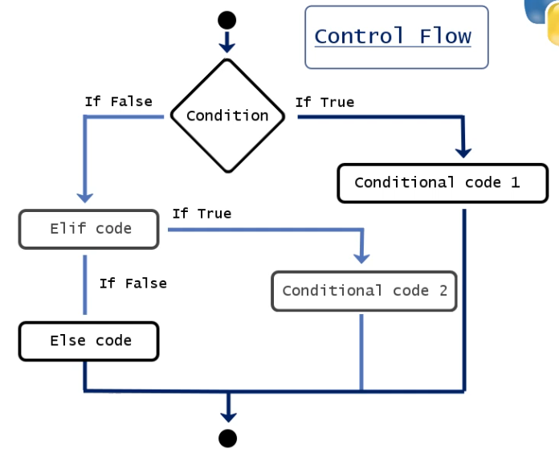

As many `elif` statements can be added, however, the computer always reads the commands in sequence, from top to bottom. The sequence stops once the condition has been satisfied, thus the order in which commands are declared matters.

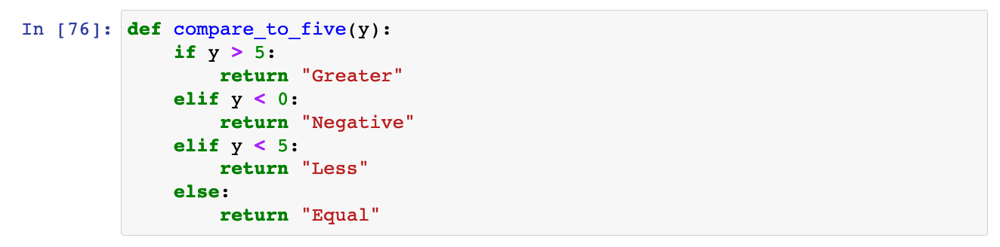

The above sequence will return `Less` if the `y = 0` condition is placed after the `y < 5` condition.

### **Python Functions**

It is important to assign a more intuitive name to a function, a brief indication of what is does. Example:, `plus_ten` or `addition_of_ten`.

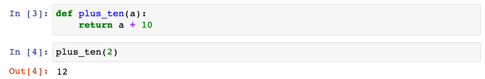

#### **Key Parts of a Function** 

**Def:** Defines the function name and parameters.

**Print** May be used in the body of a function, but does not affect the calculation of the output. Given that only a single result can be returned from a function, print may be used to insert other elements.

**Return:** Returns a value from the function. This can only be used once in a function. This does not visualize the output, it specifies what a certain function is supposed to give back.

Another approach can be to use the `result` in building the body of the function and then returning the result.

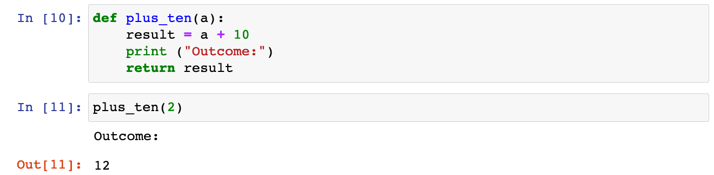

#### **Function within a Function** 

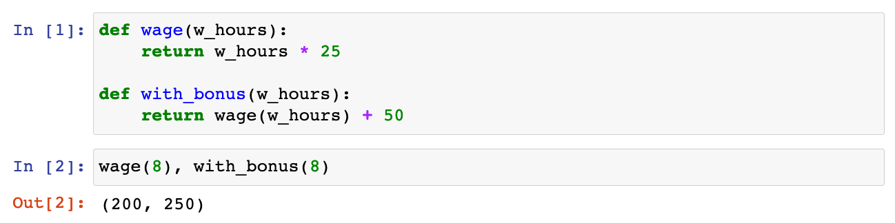

#### **Conditional Statements and Functions** 

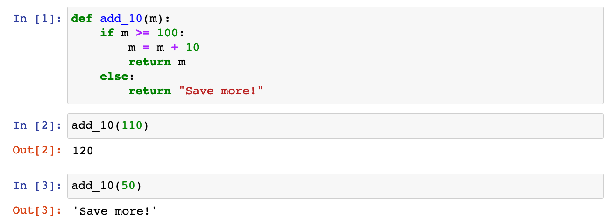

OR

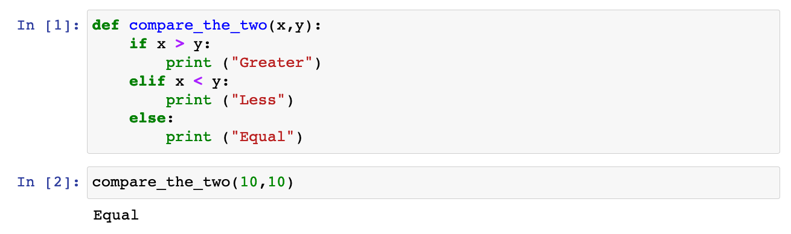

#### **Functions with Multiple Arguments** 

This is achieved by listing out all the parameters  and separating them with commas. Order matters in calling the function, else you need to specify the parameters. Example: calling `def subtract_bc(a,b,c)` as `subtract_bc(45,62,41)` or `subtract_bc(b=45,a=62,c=41)`.

#### **Built-In Functions in Python** 

Built-In Functions | Description
-------------------|----------------------------------------------------------------------------
`pow(x,y)`         | Returns x to the power of y.
`round()`          | Specifies the number of decimal points.
`abs()`            | obtains the absolute value of an argument.
`type()`           | obtains the type of variable used as an argument.
`len()`            | returns the number of elements in an object or list.
`min()`            | returns the lowest value from a sequence of numbers.
`max()`            | returns the highest value from a sequence of numbers.
`sum()`            | calculates the sum of all the elements in a list designated as an argument.

The following transform their arguments into an integer,  float and string data type, respectively:

* `int()`
* `float()`
* `str()`

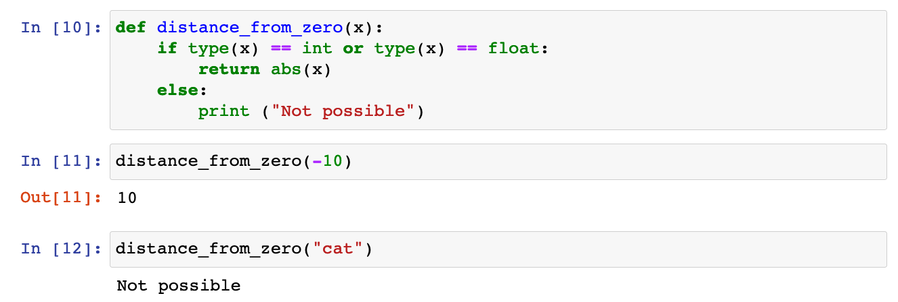

### **Lists**

This is a type of sequence of data points such as floats, integers or strings. The entire list can be accessed using the `Name_of_list` or a value in the list may be accessed by `Name_of_list [index_of_element]`. Remember to count from zero.

Replacing elements in the list:

**del** may be used to remove an item from a list. Deleting an element changes the indices of all successive elements in the list.

**Methods in Python**

Built in methods can be applied directly. Methods may be implemented by calling the object, followed by the dot operator, and then stating the method. Example: `object.method("Element")`.

The `.append()` and `.extend()` methods may be used to add elements to a list.

The `.sort()` method may be used order objects and lists in alphabetical or numerical order. The revers

It is important to note that list elements are directly treated as string values.

**List Slicing**

This may be used to obtain a desired portion of data or elements from a main source. This can be done by calling the object, followed by square brackets, and then inserting the index of the first element, followed by the index of the element after the last desired element. Example: The index of an element in a list: `Object_Name.index("Element")`

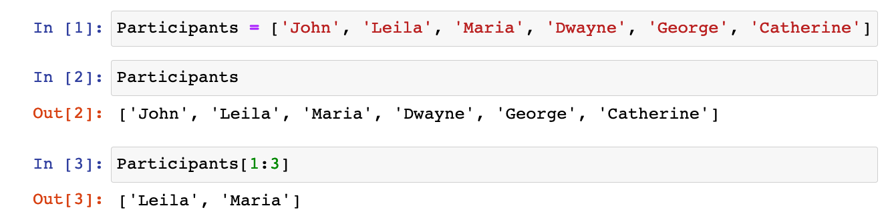

A list of lists can be obtained using the following approach:

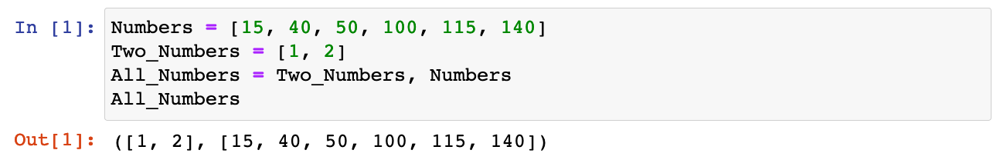

**Tuples**

These is the default data sequence type in Python. They are immutable, cannot be changed or modified. The major different between tuples and lists is that, tuple elements are placed in parenthesis instead of square brackets. Example of a tuple assignment: `x = (50, 60, 70)` or `x = 50, 60, 70` or `a, b, c = 50, 60, 70`.

Functions can provide Tuples as return values:

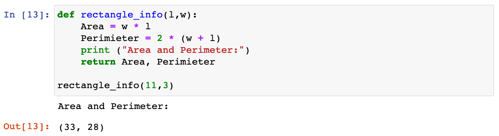

### **Python Dictionaries**

Dictionaries represent another way of storing data. Each value is associated with a certain key. More precisely a key and its respective value form a key-value pair, `'k1':"cat"`. These use curly brace `{}`. 

Values may then be accessed by their keys as opposed to an index.

New values may be added to the dictionary using the following syntax: `dictionary_name [new_key_name] = new_value_name`. 

A similar approach may be used to replace the value of an existing key: `dictionary_name [existing_key_name] = new_value_name`.

Lists may be inserted into a dictionary:

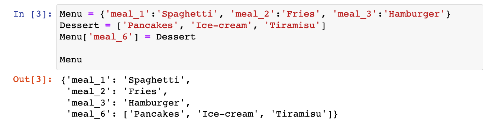

See below, for another syntax used in creating dictionaries. 

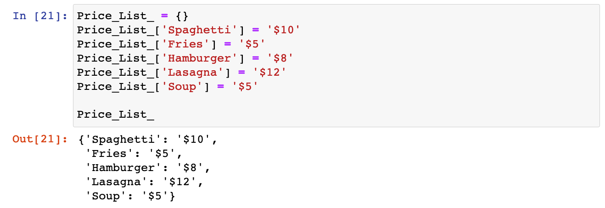

The **.get()** method can be used to obtain an object in a dictionary.

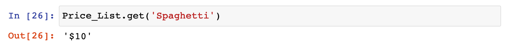

### **Using Iterations in Python**

Iteration is the ability to execute a certain code repeatedly. The iteration code and operation needs to be thorough to ensure the system does not crash by running an infinite loop.

#### **Using `for` Loops**

This can be used to perform an operation on an element. Example: a list called **Even**, for every element **n** in the list **Even** an operation is performed. Note that **n** is the loop variable.

`for` n `in` Even:\
&nbsp;&nbsp;&nbsp;&nbsp;&nbsp;&nbsp;&nbsp;&nbsp;body of the loop

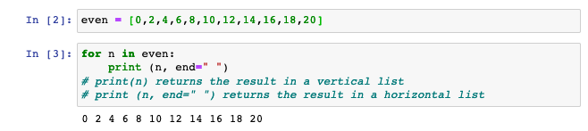

The operation in the body of the loop is performed once for each element in the **Even** list. When the system is done with the first iteration or pass of the loop, it returns to the `for` statement and picks the next element in the **Even** list. This will continue until the body of the loop has been executed for every element in the **Even** List.

#### **Using `while` Loops and Incrementing**

This can be used in stead of the for loop. Incrementing may be used to assign an operation after the body of the loop is completed.

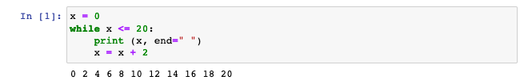

OR

By using the Python incrementing syntax, `+=` the same operation is achieved.

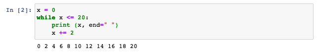

The amount being progressively added is called an **increment**. In this case, the increment is 2.

#### **Creating Lists with the `range()` Function**

 This provides a sequence of integers according to a start, stop and step value. The start value indicates the first number in the list, the stop value must be greater than the intended last value (last value + 1), while the step value represents the distance between each two consecutive values in the list. Note that the stop value is a required input, while the start (default of 0) and step values (default of 1) are optional.

Example: `range(10)` creates a range object. However, the built-in `list` function is used to display the range sequence as a list.

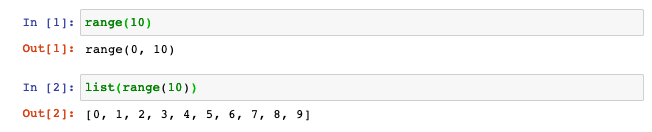

OR with a start and step value of 3 and 2 respectively.

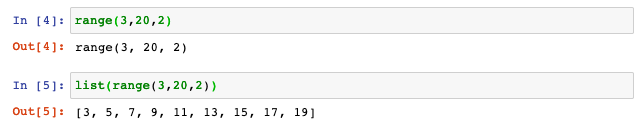

Also, the `range()` function may be used in a loop or iteration.

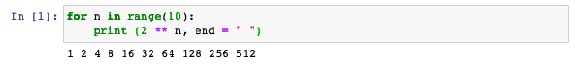

Furthermore, the range and loop may be constructed by using the length of a list.

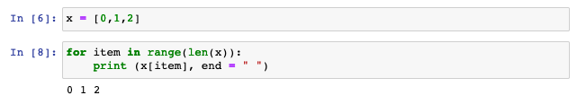

In this case `len`(x) = 3, and `range`(`len`(x)) = `range`(3) = `range`(0,3,1) = [0, 1, 2].\
The **x[item]** in the `print` section of the code uses indexing to extract each item from the x-list.

#### **Combining Conditional Statements and Loops**

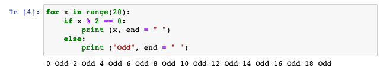

#### **Combining Conditional Statements, Functions, and Loops**

Using a rolling sum called **total** in a `for` loop

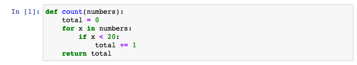\
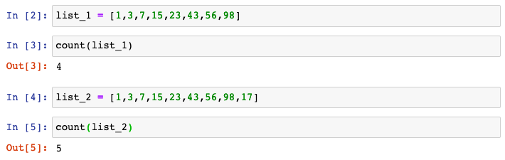

OR using a rolling sum called **total** in a `while` loop

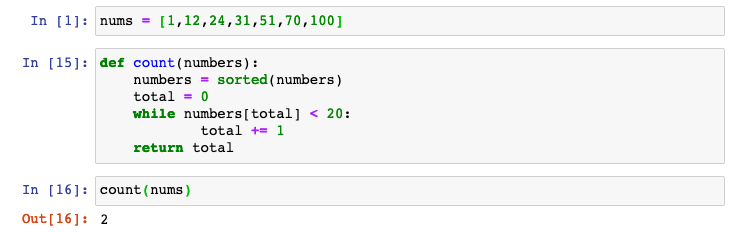

#### **Iterating over Dictionaries**

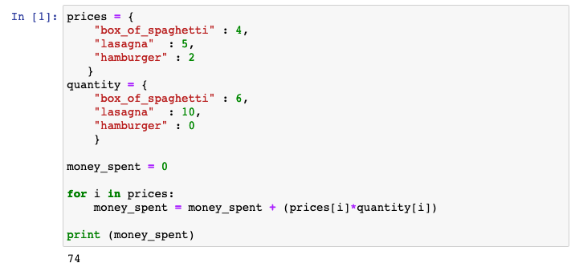

The above loops works correctly because the two dictionaries contain the same keys. Thus, it would not matter if the code loops through either the prices or quantity dictionary.

Another example can be to calculate on the total money spent for items with a price of 5 and above:

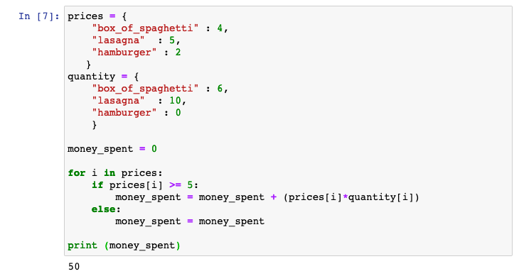