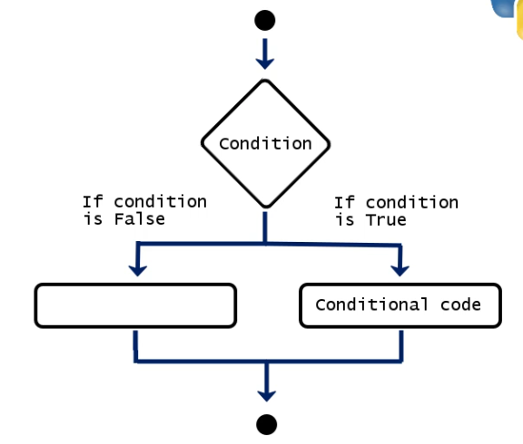

# Start of Python Training via Udemy Courses

### **Introduction**
**Program:** Sequence of instructions that designate how to execute a computation.  
**Programming:** Taking a task and writing it down in a programming language that the computer can understand and execute.  

### **Assigning Values**

A certain number of variables may be assigned to the same number of variables. The `=` operator may be used to assign or bind values to variables. For Example: `x = 8` or `x,y =(8,9)`. The system overwrites any assigned values with the most recent statement. For Example: `x = 8` (first instance), `x = 9` (second instance), now x has been reassigned the value of 9.

**Print:** Displays or prints the value of a certain variable.

**Case Sensitivity:** Ensure to retain the same case type used when assigning while printing or displaying variable. 

### **Numbers and Boolean Values**

**Integer:** Positive of negative whole number; without a decimal point. For Example: `x1 = 5`. In this scenario, x1 may be referred to as an integer. This may be confirmed using the `type(var)` function. The type function, `type (value)`, may also be applied to a value instead of a variable.

**Floating Points (floats):** Real number; with a decimal point. However `int( )` may be used to transform the variable into an integer. Furthermore, `float( )` transforms the variable into a float.

Not all variables should assume numerical values. An example of these type of values are **Boolean values**:  "True" or "False" values corresponding to 1s or 0s and On or Off. The True and False must be written with capital T and F.

### **Strings**
These are text values composed of a sequence of characters. 

Quotation marks are used to characterize values as strings. If there is a need to add strings to a return, the *+* operator is required. Two value types cannot be used at the same time, for Example: `y = 10, print (y + " Dollars")` will return an error. However `str( )` converts a number into text. 

Python can automatically discern the type of data being entered (integer, string, etc.) this does not need to be specified. The `\` is an escape character as it changes the interpretation of characters immediately after it. For Example: `'I\'m fine'` returns `"I'm fine"`. 

### **Python Syntax Fundamentals**

**Double Equality Sign:** The `==` means equals or equality of values. It returns a boolean value, True or False.

**Comments:** These are sentences not executed by the computer. They may be inserted by using a `#` symbol at the start of a sentence.

**Indexing Elements:** To obtain a charact within a string, an indexiing statemtnt is used. For Example: `"Name_of_Variable" [index_of_element]`. In python, characters are counted from 0, not from 1.

**Code Structure and Indentation:** Statements belonging to a block of code or command can be indented using the Tab key, while separate statements or blocks of commands can begin from the far left.

### **Python Operators**

Arithmetic Operators | Description
---------------------|---------------
/                    | Division
`+`                  | Addition
%                    | Remainder
`-`                  | Subtraction
`*`                  | Multiplication
**                   | Raise to Power

The following may be referred to as comparison operators with exception to `\`.

Other Operators | Description
----------------|-------------------------
<               | Less Than
`> `            | Greater Than
==              | Equality of values
\               | Continue on new line
<=              | Less Than or Equal to
!=              | Non-Equality of Values
`>=`            | Greater Than or Equal to

Logical Operators may also be referred to as Boolean Operators.

Logical Operators | Description (written in lower case)
------------------|----------------------------------------------------------
AND               | Checks whether the two statements around it are True
OR                | Checks whether at least one of the two statements is True
NOT               | Leads to the opposite of the given statement

When combining logical operators, the **order of importance matters**. NOT is 1st, AND is 2nd and OR is 3rd.

Identity Operators | Description (written in lower case)
-------------------|---------------------------------------------------
IS                 | Functions similar to the Equality of Values
IS NOT             | Functions similar to the Non-Equality of Values

### **Conditional Statements**

**IF statement:** This requires an `if condition` : `conditional code`. For Example: `if 5 == 15/3` : `print ("Hooray!")`. For better clarity, after the colon, indent the conditional code on the next line. 

**ELSE Statement:** This provides an alternative case, `else code` when the `if condition` does not satisfy the `conditional code`.

**ELSE IF or ELIF Statement:** This provides an alternative cases and ends with an `else code`. It returns the assigned result based on the given `conditional code`. 

As many elif statements can be added, however, the computer always reads the commands in sequence, from top to bottom. The sequence stops once the condition has been satisfied, thus the order in which commands are declared matters.

The above sequence will return `Less` if the `y = 0` condition is placed after the `y < 5` condition.
